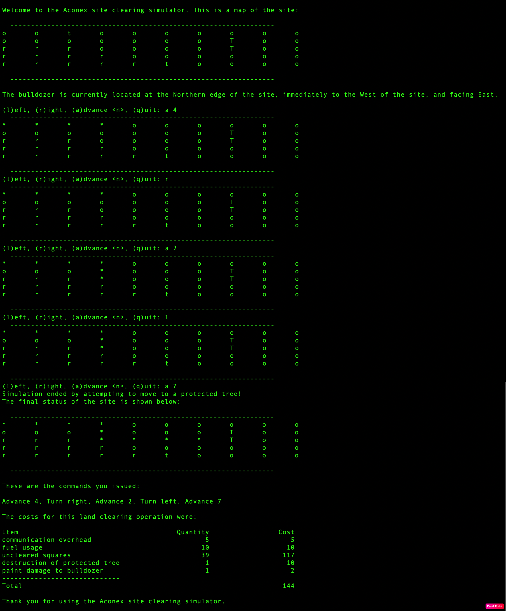

# oracle_simulator

# Goal
Before a supervisor can work at a construction site, they are to be trained in how to coordinate with a bulldozer operator to clear the site in preparation for building. The training consists of interactive sessions with a simulator. This repo contains site clearing simulator written in Python

# Installation
Clone the repo and install Python3

git clone https://github.com/shahramatuber/oracle_simulator.git

Instructions on how to install python 3 can be found [here](https://realpython.com/installing-python/)

# Design 
This project consists of 3 main classes:

1- SiteMap class which is defined in `./core/site_map.py` and represents the site that will be cleared. It will be initialized by a given filepath which represents a grid of plain land, rock, removable tree, and protected tree.

2- Expense class which is defined in `./core/expense.py` and represents the costs associated with a simulation.

3- Bulldozer class which is defined in `./core/bulldozer.py` and represents a bulldozer. An object of SiteMap and Expense classes is created as member variables of Bulldozer objects. At each step, the bulldozer receives a command, updates its location, clears the land if possible, and updates the cost of operation in its expense member variable. It also keeps track of all the commands it has received since the beginning of simulation.

There is a driver program in `./simulator.py`, which instantiates a bulldozer, and sends commands to the bulldozer until user quits, or the bulldozer hits a protected tree, or the bulldozer goes out of the site map. Any of those terminating actions will end the simulation and will generate a report of all the commands and per-item and total cost of the executed commands. 

After each command, the updated site plan is printed out on the screen so that the user knows what the result of the previous action on the site map was.

**Notes**:

•	A square block that is cleared is shown by ‘*’ on the screen.

•	Square blocks that contain protected trees are considered as non-clearable blocks.

•	If bulldozer passes through a removable tree without stopping on it, a paint damage cost will be considered. However, if it has a stop on it, paint damage is not considered.

•	According to the example provided in the problem description, quit command is considered to have zero cost of communication overhead.

# Running Unit Tests
If you would like to run all the test at once, run the following command from repository root diretory:

`py.test`

If you want to run tests of a specific file, run the command above and specify the file path. For example:

`py.test ./test/expense.py`

# Usage
Run the following command from the repository root directory:

`python3 simulator.py <path-to-the-sitemap-file>`
  
  
There is a test file included in this repo that you can use:

`python3 simulator.py ./test/fixtures/sample1.txt`

# Example
`python3 simulator.py ./test/fixtures/sample1.txt`

